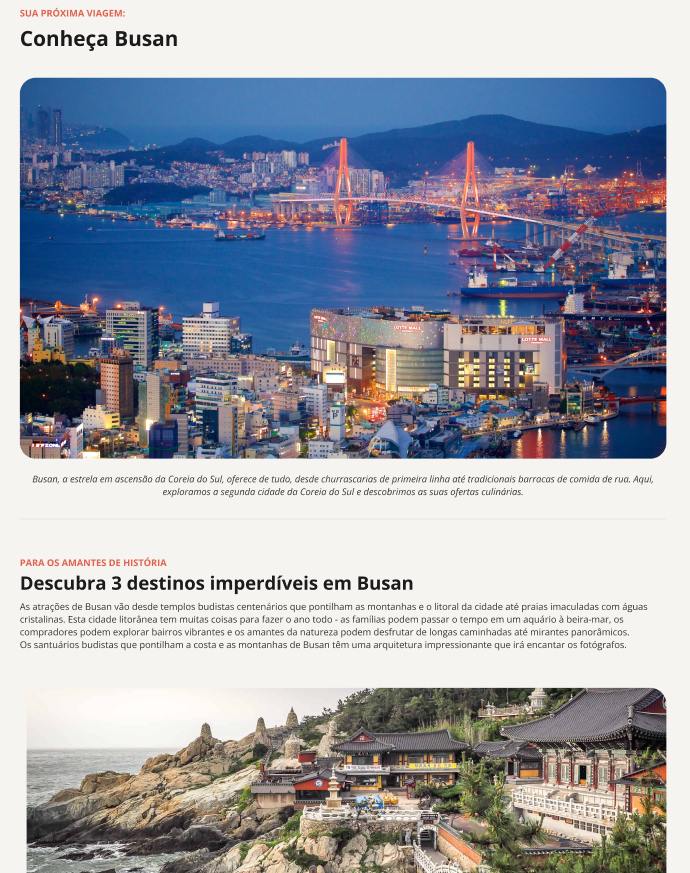

<h1 align="center"> Local Turistico </h1>

<a href="https://debstd22.github.io/Pagina-de-Receitas/">Acesse o projeto finalizado clicando aqui</a>

   <a href="#objetivo-do-projeto">Objetivo do Projeto</a>&nbsp;&nbsp;&nbsp;|&nbsp;&nbsp;&nbsp;
   <a href="#tecnologias-utilizadas">Tecnologias Utilizadas</a>&nbsp;&nbsp;&nbsp;|&nbsp;&nbsp;&nbsp;
   <a href="#funcionalidades">Funcionalidades</a>&nbsp;&nbsp;&nbsp;|&nbsp;&nbsp;&nbsp;
   <a href="#layout">Layout</a>&nbsp;&nbsp;&nbsp;

&nbsp;

&nbsp;

## Objetivo do Projeto

Este projeto foi desenvolvido com o objetivo de colocar em prática os conhecimentos adquiridos em HTML e CSS, por meio da criação de uma página simples sobre um local turístico. A proposta foi estruturar e estilizar o conteúdo de forma organizada, aplicando boas práticas de marcação semântica e design visual.

## Tecnologias Utilizadas

* HTML5
* CSS3

## Funcionalidades

* Estruturação semântica de uma página sobre um local turístico
* Exibição de informações como descrição, imagens e pontos de interesse
* Estilização da página com CSS
* Organização visual para melhorar a experiência do usuário

## Layout

Você pode visualizar o layout do projeto <a href="https://www.figma.com/design/GcftoT9EGNAosOgYzyJrcW/Local-Tur%C3%ADstico--Community---Copy-?node-id=0-1&p=f&t=m8kG6WPMeIRAaoCC-0">CLICANDO AQUI</a>. É necessário ter conta do <a href="https://www.figma.com/login?is_not_gen_0=true">FIGMA</a> para acessá-lo.
